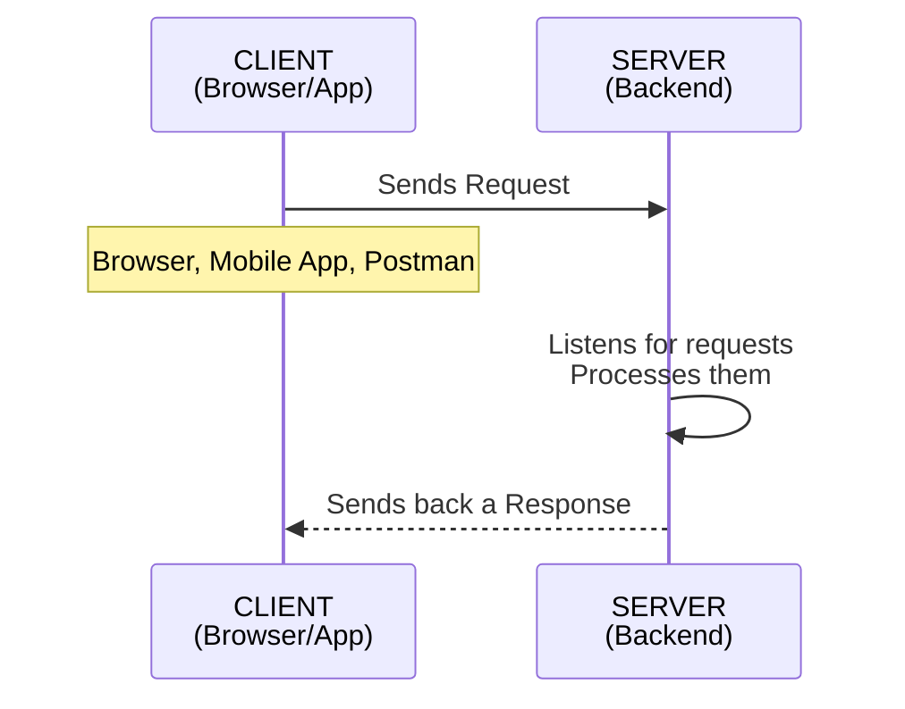
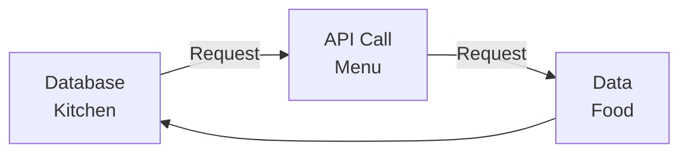
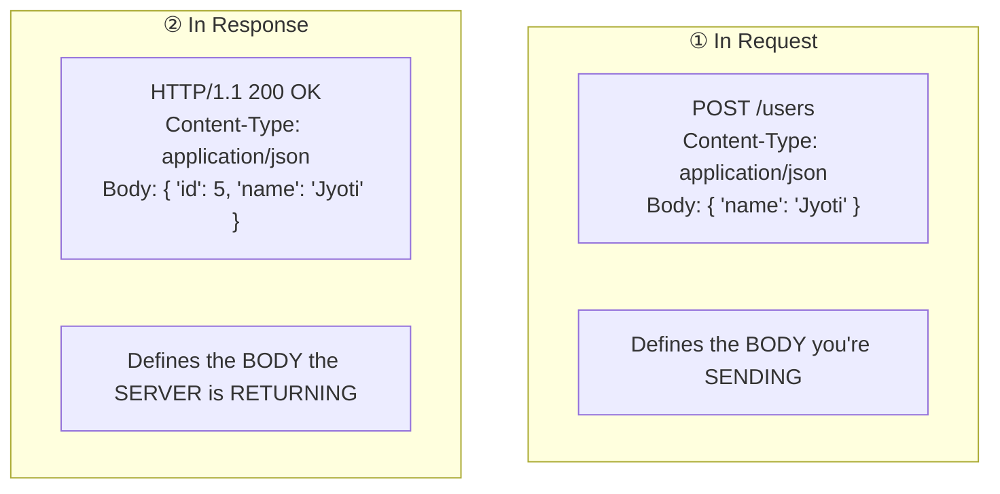
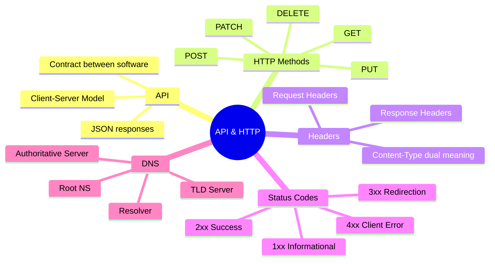

# 🌐 Web Development — API & HTTP Fundamentals
### Airtribe Session 1 — 4th July 2026

---

## 📑 Table of Contents
1. [What is an API?](#-what-is-an-api)
2. [Client-Server Communication](#-client-server-communication)
3. [HTTP Request Object](#-http-request-object)
4. [HTTP Methods](#-http-methods)
5. [HTTP Response Object](#-http-response-object)
6. [Headers: Request vs Response](#-headers-request-vs-response)
7. [Content-Type: Context Matters](#-content-type-context-matters)
8. [HTTP Status Codes](#-http-status-codes)
9. [DNS Resolution Deep Dive](#-dns-resolution-deep-dive)
10. [Frontend vs Backend](#-frontend-vs-backend)

---

## 🔌 What is an API?

**API — Application Programming Interface**

> A basic model of how apps communicate over a network.

**Definition:** A contract that lets two pieces of software or services talk to each other — **without either side needing to know the other's internal code.**

### Example: Amazon
Instead of searching Amazon's database directly, they expose an API endpoint:

```
GET https://api.amazon.com/products/123
```

You just call it and get structured data back — usually in **JSON** (JavaScript Object Notation).

---

## 🤝 Client-Server Communication



**Communication usually happens over HTTP/HTTPS.**

### Real World Example — amazon.com
| Step | Actor | Action |
|------|-------|--------|
| 1 | Browser (Client) | Sends a request |
| 2 | Amazon's Server | Processes it |
| 3 | Server | Sends back an HTML page |

---

## 📨 HTTP Request Object

An HTTP request (a **query**) is made of 4 parts:

| Component | Description |
|---|---|
| **Method** | GET, PUT, POST, DELETE (others: PATCH, OPTIONS) |
| **URL / Endpoint** | The resource being addressed |
| **Headers** | Metadata about the request |
| **Body** | The actual data payload |

---

## 🧭 HTTP Methods

> **Analogy: Restaurant Menu 🍽️**
> Database (kitchen) ⇄ API Call (menu) ⇄ Data Request (food)



| Method | Action | Example |
|---|---|---|
| **GET** | Read / fetch data | Get user's profile |
| **POST** | Create new data | Sign up a new user |
| **PUT** | Update (replace) — **whole** resource | Update entire profile |
| **PATCH** | Update (**partial**) resource | Update just the email |
| **DELETE** | Remove data | Delete an account |

### 🐍 Python-style Examples
```http
GET /users/5        → fetch user 5
POST /users         → create new user (data sent in body)
DELETE /users/5      → delete user 5
```

**❓ Graph QL Quirk:** Every request in GraphQL is technically a `GET` request, but in return it behaves like a `POST`.

---

## 📬 HTTP Response Object

| Component | Mandatory? |
|---|---|
| **Headers** (may contain Cookie) | ❌ No — empty headers possible |
| **Status Code** | ✅ Yes |
| **Response Body** | ❌ No |

> ⚠️ Request Headers vs Response Headers are **two different things** — don't confuse them just because both are called "headers."

---

## 🏷️ Headers: Request vs Response

> **Headers = metadata** — extra info sent along with the actual request/response.
> They **describe** the content rather than **being** the content itself.

### 📦 Analogy: Sending a Package
| Part | Represents |
|---|---|
| **Body** | What's inside the box |
| **Headers** | The label on the outside of the box |

---

### 1️⃣ Request Headers (Client → Server)
> Sent by the client to tell the server **how to handle the request** or **what the client wants back**.

```http
GET /users/5 HTTP/1.1
Host: api.example.com
Authorization: Bearer eyJhbGciOi...
Content-Type: application/json
Accept: application/json
User-Agent: Mozilla/5.0
```

**Interpretation:** *Showing your ID (`Authorization`) & telling the receptionist "I want the report in PDF, not Word" (`Accept`).*

| Header | Meaning |
|---|---|
| **Host** | Which domain/server you're talking to |
| **Authorization** | Proves who you are (token, API key) |
| **Content-Type** | Format of data **you're sending** (e.g. JSON) |
| **Accept** | Format you **want back** (JSON, XML, etc.) |
| **User-Agent** | Info about the client (browser, OS, app) |

---

### 2️⃣ Response Headers (Server → Client)
> Sent by the server to tell the client about the response it's returning.

```http
HTTP/1.1 200 OK
Content-Type: application/json
Content-Length: 348
Set-Cookie: session_id=abc123; HttpOnly
Cache-Control: no-cache
```

| Header | Meaning |
|---|---|
| **Content-Type** | Format of data being sent back |
| **Content-Length** | Size of response body (in bytes) |
| **Set-Cookie** | Server telling browser to store a cookie |
| **Cache-Control** | How long client can cache this response |

---

## 🔁 Content-Type: Context Matters

> ⭐ **`Content-Type` appears in BOTH — but means different things depending on context.**



| | Request Headers | Response Headers |
|---|---|---|
| **Sent by** | Client, explaining itself to the server | Server, explaining to the client |
| **`Content-Type` means** | Format of body being **sent** | Format of body being **returned** |

---

## 🚦 HTTP Status Codes

> **Server's way of telling the client what happened to the request.** Grouped by first digit.

| Range | Meaning | Common Examples |
|---|---|---|
| **1xx** | Informational | 100 Continue |
| **2xx** | Success | 200 OK, 201 Created, 204 No Content |
| **3xx** | Redirection | 301 Moved, 304 Not Modified |
| **4xx** | Client Error *(your fault)* | 400 Bad Request, 401 Unauthorized |

---

## 🌍 DNS Resolution Deep Dive

### The Big Question: What's the first thing a server needs?


> **At blackbox level:** DNS has a mapping of **Domain → IP Address**.

### ⚠️ Problem: What if the data is very big / DNS goes down?
- A **Centralized System** becomes a **bottleneck** → **Single Point of Failure**
- **Solution:** 🏗️ **Distributed Architecture / Distributed System**

---

### Full DNS Lookup Chain


| Level | Managed By |
|---|---|
| **TLD** (Top Level Domain) — `.com`, `.live`, `.org` | Managed by developers of the registry (e.g. ICANN-delegated) |
| **Authoritative NS (Name Server)** | Admin of the auth NS — e.g. Google for google.com |

### ❓ Why does the Root NS matter?
> *"Root NS exists so that every DNS lookup in the world has one guaranteed, known starting point — without it, there'd be no way to even begin the search."*

- 🎯 Starting point of the entire DNS lookup chain
- 📇 Like a **MASTER INDEX** — doesn't know the final answer, but knows **who to ask**
- 🔁 There is **not just one** Root NS — in case of failure/downtime, it's a **replicated setup**
- 🌐 **13 root server addresses** are hardcoded worldwide

### ❓ Why not skip Root and go directly to `.com` servers?
- The client machine doesn't inherently know the IP of `.com`
- Nor does the TLD server know the IP of `.com` server initially
- **Root NS's job:** one fixed, well-known starting point that every DNS resolver in the world knows the address of
  → All root IPs are **hardcoded / pre-configured** on all resolvers

---

## 🎨 Frontend vs Backend

| Aspect | Frontend | Backend |
|---|---|---|
| Also known as | Client-side programming | Server-side logic |
| Handles | User Interface | API, sensitive stuff |
| Business logic | ✅ Happens here | ❌ *(marked "wrong statement" — business logic lives on backend)* |
| Focus | UI/UX | Infrastructure & Stability |

> 📝 Note: The notes flag *"Business logic happens on Frontend"* as a **wrong statement** — business logic actually belongs on the **backend**, while frontend focuses on UI/UX and client-side programming.

---

## 🗂️ Quick Reference Summary



---

*📓 Notes compiled from Airtribe Session 1 (Web Development) — 4th July 2026*